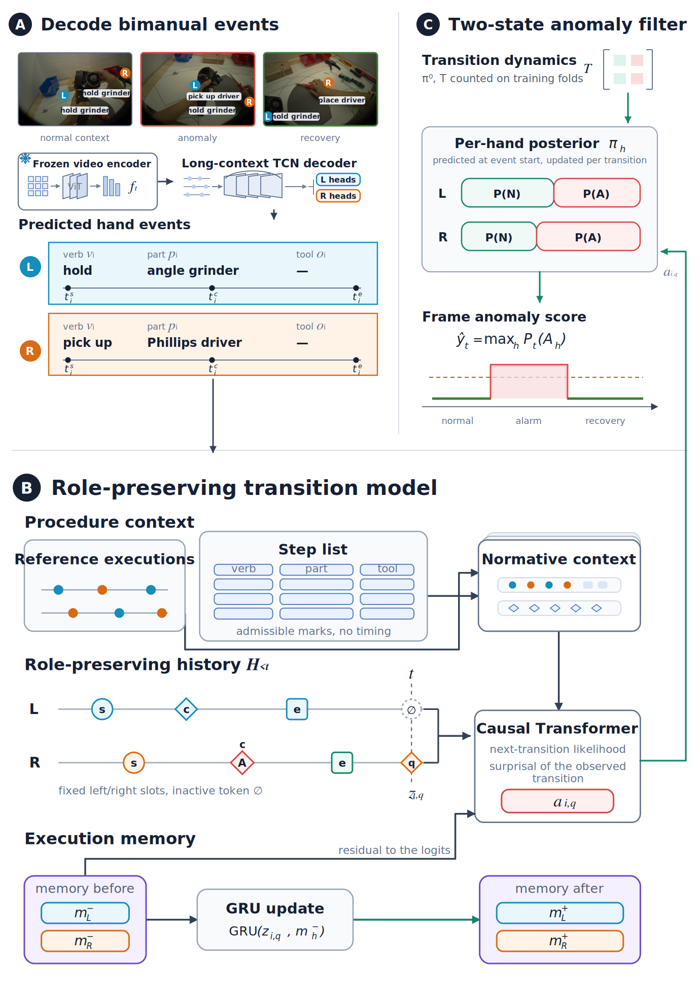

<div align="center">

# HACT: Hand-Aware Transition Modeling for Bimanual Procedural Anomaly Detection

**Official implementation of "Hand-Aware Transition Modeling for Bimanual Procedural Anomaly Detection"**

[Di Wen](https://github.com/Kratos-Wen)<sup>1,\*</sup>, Jimmy Weissert<sup>1,\*</sup>, Luc Maria Scherrer<sup>1,\*</sup>, Cedric Zöllner<sup>1,\*</sup>, Kailun Yang<sup>2</sup>,<br>
Ruiping Liu<sup>1</sup>, Yufan Chen<sup>1</sup>, Jiale Wei<sup>1</sup>, Junwei Zheng<sup>1</sup>, Kunyu Peng<sup>1,†</sup>

<sup>1</sup>Karlsruhe Institute of Technology &nbsp;&nbsp; <sup>2</sup>Hunan University<br>
<sup>\*</sup>Equal contribution &nbsp;&nbsp; <sup>†</sup>Corresponding author

[-b31b1b.svg)](#citation)
[](https://huggingface.co/datasets/KratosWen/IMPACT)
[](https://www.python.org/)
[](https://pytorch.org/)
[](LICENSE)

</div>

This repository is the official implementation of the paper
**"Hand-Aware Transition Modeling for Bimanual Procedural Anomaly Detection"**.
It contains the model, the training and evaluation code, the configurations of the full model and of every
ablation, the baselines trained on the shared features, and the converted annotations and folds of the public
benchmark.

<p align="center">
  
</p>

<p align="center"><em>
Overview of HACT. (A) A frozen video encoder and a long-context decoder predict per-hand events.
(B) The role-preserving transition model scores every hand transition by its surprisal under the joint
history of both hands and the procedure context. (C) A two-state filter turns the evidence into a per-hand
anomaly posterior and a frame score.
</em></p>

## Overview

Procedural anomaly detection in bimanual assembly requires judging each hand action against the execution so
far. A corrective action may look unusual in isolation, while a visually plausible action can violate the
order of the procedure. HACT models the execution as a causal stream of structured transitions of the two
hands:

- **Bimanual event decoding.** A temporal convolutional decoder on frozen frame features predicts phase, verb,
  part and tool per hand, without a hand or object detector.
- **Role-preserving history.** The left and the right hand keep fixed slots, with their difference and product
  as explicit interaction terms and a learned token for an inactive hand.
- **Marked temporal point process.** A causal Transformer with cross-attention to two reference executions and
  an order-free step list predicts the next transition and its timing; the surprisal of the observed
  transition is the anomaly evidence.
- **Two-state filter.** Calibrated evidence updates a per-hand posterior over normal and anomalous execution.
- **Recovery-aware evaluation.** Every method is evaluated on fully predicted events with participant-disjoint
  folds, and the recovery false-positive rate is read at an operating point selected on validation participants.

## Contents

- [Results](#results)
- [Installation](#installation)
- [Data](#data)
- [Training and evaluation](#training-and-evaluation)
- [Repository layout](#repository-layout)
- [Citation](#citation)
- [Acknowledgments](#acknowledgments)
- [License](#license)

## Results

Fully predicted, participant-disjoint five-fold evaluation on IMPACT-ego Reassembly A (public). R-FPR is the
recovery false-positive rate at the threshold that reaches recall .3 on the validation participants.

| Method | AUPRC | F1 | R-FPR | R-FPR (covered) |
|---|---|---|---|---|
| Causal TCN | .095 | .224 | .284 | .284 |
| MistSense | .129 | .224 | .325 | .325 |
| EgoPER-V | .115 | .182 | .448 | .450 |
| **HACT** | **.160** | **.252** | **.225** | **.281** |

Transfer to Reassembly B, the Reassembly A fold models applied unchanged:

| Method | AUPRC | F1 |
|---|---|---|
| Causal TCN | .153 | .343 |
| MistSense | .218 | .347 |
| **HACT** | **.238** | **.358** |

## Installation

```bash
conda create -n hact python=3.10 -y && conda activate hact
pip install -r requirements.txt
```

Training one fold takes a few minutes on a single GPU; the model has 1.49M parameters beyond the frozen encoder.

## Data

HACT uses the public [IMPACT](https://huggingface.co/datasets/KratosWen/IMPACT) v1.1 release (CC BY-NC-SA 4.0),
egocentric view. This repository ships the converted event annotations, the participant-disjoint folds, and the
vocabulary, so only the features have to be prepared:

```bash
# VideoMAE V2 features shipped with IMPACT -> 15 fps cache read by HACT
python tools/build_feature_cache.py --impact-features <IMPACT>/features/VideoMAEv2 \
    --benchmark data/impact_public/reassembly_a --output data/features/impact_videomaev2_15fps
python tools/build_feature_cache.py --impact-features <IMPACT>/features/VideoMAEv2 \
    --benchmark data/impact_public/reassembly_b_transfer --output data/features/impact_videomaev2_15fps
```

| Path | Content |
|---|---|
| `data/impact_public/reassembly_a` | 41 executions by 12 participants, two reference executions, five folds |
| `data/impact_public/reassembly_b_transfer` | the same folds with the 10 Reassembly B recordings as test recordings |
| `configs/public_impact` | verb, part and tool vocabulary, and the step list derived from the reference executions |

The public release has no contact-onset annotation; the converted annotations place the onset at the midpoint
of each event (`data/impact_public/preparation_report.json`).

## Training and evaluation

All commands run from the repository root.

```bash
# HACT: five folds, rescoring on predicted events, two-state filter, evaluation
NAME=hact_reassembly_a GPUS="0 1 2 3" scripts/run_hact.sh 0

# dense baselines on the same features and folds
GPUS="0 1 2 3" scripts/run_frame_baseline.sh causal_tcn
GPUS="0 1 2 3" scripts/run_frame_baseline.sh mistsense

# transfer to Reassembly B without retraining
NAME=hact_reassembly_a scripts/run_transfer_b.sh 0
```

Results are written to `outputs/results/`: `<name>_seed<s>_frame.json` holds the pooled out-of-fold AUPRC and F1,
`<name>_seed<s>_recovery.json` the recovery false-positive rate at the validation-selected operating points
together with the achieved test recall and the rate on covered recovery frames.

Every threshold, the temperature, early stopping and model selection use the validation participants of the
fold; the test recordings are read once.

### Ablations

| Config | Variant |
|---|---|
| `hact_reassembly_a` | full model |
| `hact_reassembly_a_norole` | no role-preserving history |
| `hact_reassembly_a_nointeract` | no interaction terms between the two hand slots |
| `hact_reassembly_a_nomemory` | no execution memory |
| `hact_reassembly_a_gatedwrite` | memory write scaled by one minus the anomaly probability |
| `hact_reassembly_a_visualonly` | event decoder and visual residual only |
| `hact_reassembly_a_norecw` | no recovery-frame weight in the evidence loss |

```bash
NAME=hact_reassembly_a_norole GPUS="0 1 2 3" scripts/run_hact.sh 0
```

## Repository layout

| Path | Content |
|---|---|
| `pipeline/bimanual_transition_model.py` | event decoder, role-preserving transition model, evidence head, execution memory |
| `pipeline/bimanual_transition_data.py` | events, transitions, folds |
| `pipeline/step2_bimanual_transition.py` | staged training and inference (`run --config ... --fold ... --seed ...`) |
| `integrations/rescore_hact_transitions.py` | scoring on fully predicted events |
| `integrations/apply_hact_two_state_filter.py` | two-state anomaly filter |
| `integrations/evaluate_fully_predicted.py` | shared frame-level evaluation of all methods |
| `integrations/recovery_at_validation_recall.py` | recovery false-positive rate at validation-selected thresholds |
| `integrations/train_frame_baselines.py` | causal TCN and MistSense baselines |
| `integrations/zeroshot_vlm_baseline.py` | zero-shot Qwen2.5-VL baseline |
| `tools/build_feature_cache.py` | 15 fps feature cache from the IMPACT features |

The second bimanual collection reported in the paper will be added to this repository together with its
configurations once it is released.

## Citation

```bibtex
@article{wen2026hact,
  title   = {Hand-Aware Transition Modeling for Bimanual Procedural Anomaly Detection},
  author  = {Wen, Di and Weissert, Jimmy and Scherrer, Luc Maria and Z{\"o}llner, Cedric and Yang, Kailun and
             Liu, Ruiping and Chen, Yufan and Wei, Jiale and Zheng, Junwei and Peng, Kunyu},
  year    = {2026}
}
```

## Acknowledgments

The project is funded by the Deutsche Forschungsgemeinschaft (DFG, German Research Foundation), SFB-1574,
471687386. This work was supported in part by the SmartAge project sponsored by the Carl Zeiss Stiftung
(P2019-01-003; 2021-2026). The authors gratefully acknowledge the computing time provided on the
high-performance computer HoreKa by the National High-Performance Computing Center at KIT (NHR@KIT).

## License

The code is released under the MIT License. The annotations in `data/impact_public` are derived from IMPACT
and are distributed under CC BY-NC-SA 4.0.
